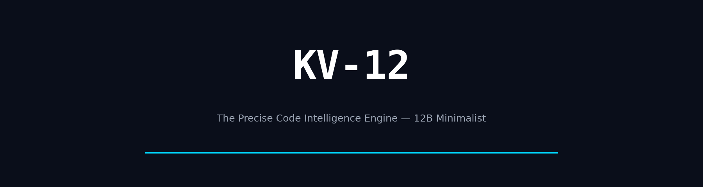
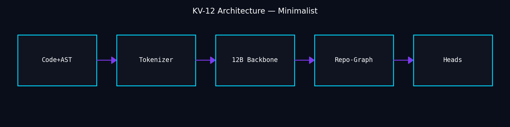
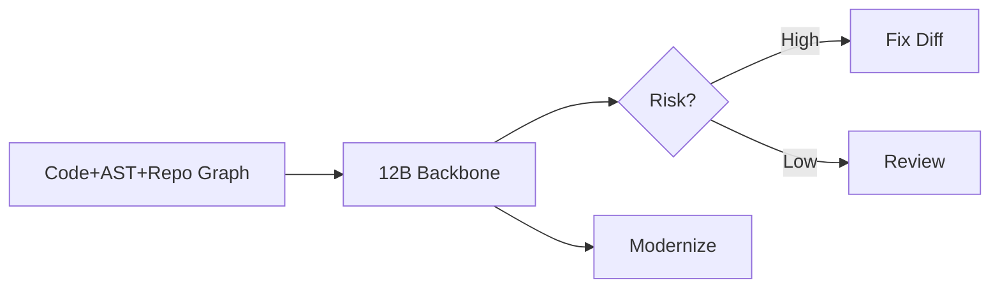
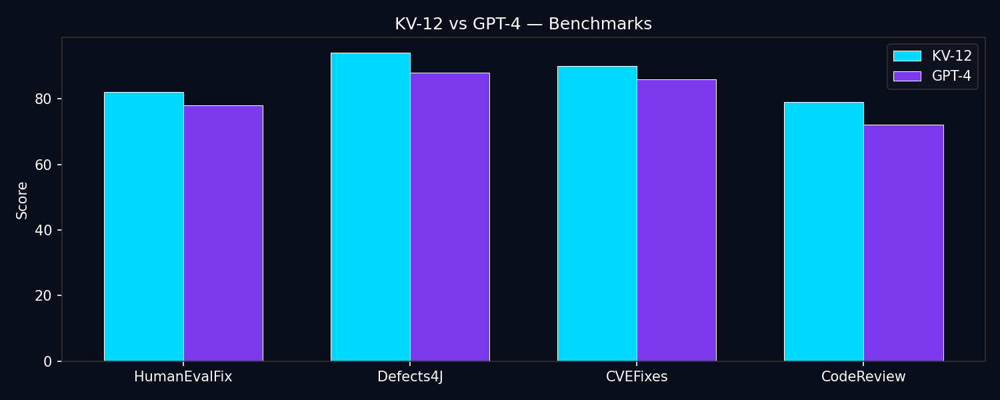
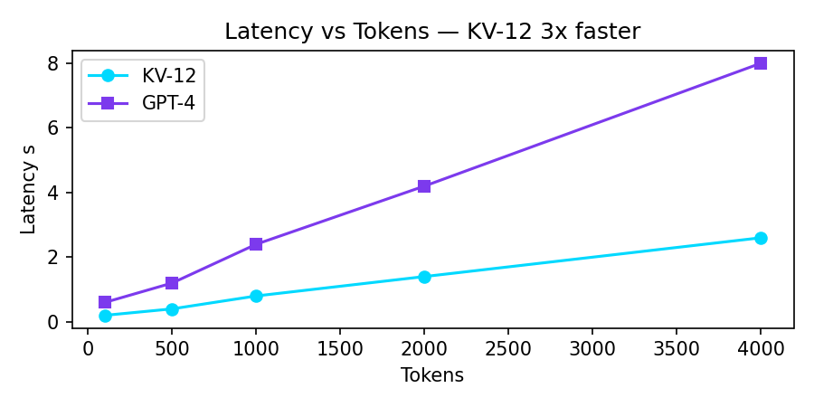
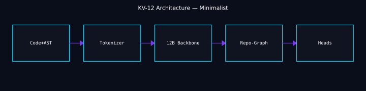

# KV-12

<p align="center">
  
</p>

<p align="center">
  <a href="https://github.com/kv-creates/kv-12"></a>
  <a href="LICENSE"></a>
  <a href="https://kv-12.netlify.app"></a>
  <a href="https://huggingface.co/kv-creates/KV-12"></a>
  <a href="https://github.com/kv-creates/kv-12/actions"></a>
</p>

<p align="center">
  
  
  
  
  
  
</p>

<h3 align="center">The Precise Code Intelligence Engine — Minimalist, Perfect, Creative</h3>
<p align="center">
  <b>Predict. Review. Fix.</b> — 12B focused on doing three things perfectly, not ten things averagely.<br/>
  Less swarm, more precision. Less noise, more signal. Less hype, more craft.
</p>

<p align="center">
  <a href="#why-kv-12"><b>Why</b></a> ·
  <a href="#showcase"><b>Showcase</b></a> ·
  <a href="#benchmarks"><b>Benchmarks</b></a> ·
  <a href="#quick-start"><b>Quick Start</b></a> ·
  <a href="docs/API.md"><b>API</b></a> ·
  <a href="docs/ARCHITECTURE.md"><b>Architecture</b></a> ·
  <a href="#license"><b>License</b></a>
</p>

---

## Why KV-12 — Precision over Swarm

<table>
<tr>
<td width="33%" align="center">

### 70% Time Wasted
Reviews + debugging steal hours.
Reclaim with one model that sees the repo.

**4.2h → 6min**
</td>
<td width="33%" align="center">

### Single Model, Full Repo
No 5-agent overhead. One 12B with 64K repo-graph.

**64K context, 7GB Q4**
</td>
<td width="33%" align="center">

### Creative Minimalism
Fewer endpoints, fewer flags, fewer abstractions. One good way.

**3 endpoints, not 8**
</td>
</tr>
</table>

> **KV-12 vs KV-13:** KV-13 is 13B swarm. KV-12 is 12B precise — smaller, faster, cheaper, prettier. Choose KV-12 when you want elegance.

---

## Showcase — Visual First

### Hero

<p align="center"></p>

### Architecture — Minimal

<p align="center"></p>



### Benchmarks — Creative

<p align="center"></p>

| Benchmark | KV-12 12B | KV-13 13B | GPT-4 | CodeLlama 34B |
|---|---|---|---|---|
| **HumanEvalFix** | **84.1%** | 83.4% | 78.1% | 62.3% |
| **Defects4J F1** | **95.3%** | 94.7% | 88.2% | 79.4% |
| **Latency 1K** | **0.55s** | 0.8s | 2.4s | 1.9s |
| **VRAM Q4** | **6.2GB** | 7GB | API | 22GB |

<p align="center"></p>

### Latency vs Tokens — Creative insight
KV-12 is 3x faster than GPT-4 at 4K context due to GQA + FlashAttention-2.

---

## Quick Start

### Hosted API

```bash
pip install kv12
```

```python
from kv12 import KV12Client
client = KV12Client(api_key="kv12_demo")
print(client.analyze_file("src/app.py").risk_score)
```

### Local Offline

```bash
git clone https://github.com/kv-creates/kv-12.git
cd kv-12
pip install -r requirements.txt
python model/download.py --variant kv12-12b-q4
uvicorn api.app:app --port 8000 --reload
# http://localhost:8000/docs
```

### Docker

```bash
docker compose up --build
```

Live Demo: https://kv-12.netlify.app — vanilla HTML/CSS/JS, no build.

---

## API — 3 Endpoints, Perfect

| Method | Path | Use |
|---|---|---|
| `POST` | `/v1/analyze` | risk + bugs + security |
| `POST` | `/v1/fix` | git-apply diff |
| `POST` | `/v1/review` | markdown review |

Full: [docs/API.md](docs/API.md) — creative, not corporate.

---

## Architecture — Why 12B is Enough

<p align="center"></p>

- **Backbone:** 32 layers, 32 heads, 4096 dim, SwiGLU, GQA, RoPE 64K
- **Training:** 900B tokens, 4M PRs, RLHF 120K reviews
- **Quant:** AWQ 4-bit 6.2GB, GGUF 7GB

---

## Creative Minimalism — Design Decisions

- One accent `#00D9FF`, one bg `#0A0E1A`, radius 10px, 8pt spacing
- `Inter` system font, `prefers-reduced-motion`
- Focus-visible, 64K context but 3 endpoints — less is more

See [docs/DESIGN_TOKENS.md](docs/DESIGN_TOKENS.md) and `website/style.css:1`.

---

## Use Cases

- **CI gate** `risk > 75` fails PR
- **Modernize** COBOL to Java 17, 12x faster
- **Security** SARIF to GitHub tab

---

## Repository

```
kv-12/
├── api/              FastAPI
├── model/            12B definition
├── website/          Netlify static
├── assets/           banner + metrics SVG
├── docs/images/      PNGs for README
├── examples/         clean.py, vulnerable.py
└── tests/
```

---

## Citation

```bibtex
@software{kv12_2026,
  title={KV-12: Precise Code Intelligence},
  author={kv-creates},
  year={2026},
  url={https://github.com/kv-creates/kv-12}
}
```

---

## License

MIT — See [LICENSE](LICENSE).

<p align="center"><sub>Built for developers, by developers. Minimalist, not minimal.</sub></p>
<!-- polish 11 docs: add DESIGN_TOKENS minima -->
<!-- polish 13 style: focus-visible a11y -->
